# Dashboard – Prédiction du risque de défaut de paiement

## Introduction

L’objectif de ce projet est de développer un **outil interactif de prédiction** du risque client pour le secteur bancaire. Il permet d’identifier la probabilité de **défaut de paiement** d’un client à partir de ses données financières et comportementales.

Ce projet illustre l’application pratique du Machine Learning dans le domaine financier, en combinant :

- La modélisation prédictive pour estimer le risque client.

- L’interprétabilité des résultats via des visualisations et analyses de l’importance des variables (SHAP).

- La mise en production et le suivi opérationnel grâce aux pratiques MLOps : déploiement d’API, dashboard interactif, suivi des modèles et détection des dérives de données en production.

Le résultat est un dashboard interactif permettant aux décideurs bancaires de visualiser rapidement le risque de chaque client, comprendre les facteurs clés et prendre des décisions éclairées.

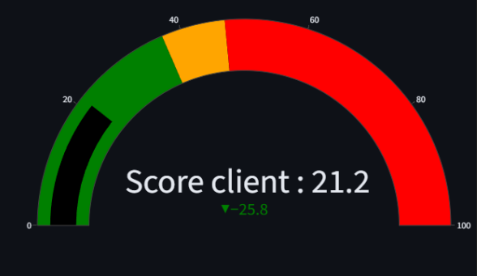

## Objectifs
- Vérifier la qualité et la structure du jeu de données.  
- Réaliser une **analyse exploratoire** pour identifier les variables explicatives pertinentes.  
- Traiter le **déséquilibre des classes** (clients solvables majoritaires).  
- Comparer plusieurs modèles de classification : régression logistique, gradient boosting (`LightGBM`).  
- Optimiser les hyperparamètres et ajuster le **seuil de décision** pour maximiser le rappel (Recall).  
- Suivre et tracer les expériences avec **MLflow**.  
- Déployer une **API de scoring** avec FastAPI.  
- Concevoir un **dashboard Streamlit** pour l’interprétation des résultats.  
- Mettre en place un pipeline **CI/CD** avec GitHub Actions et un déploiement sur Azure.  
- Surveiller les dérives de données avec **Evidently AI**.  

## Données
- **Source** : [dataset de crédit (informations clients et prêts)](https://www.kaggle.com/competitions/home-credit-default-risk/overview).  
- 7 fichiers de données totalisant **307 000 clients**  
- **121 features**  
- Target : `0 = bon client`, `1 = défaut`  
- Dataset fortement déséquilibré : **90% bons clients, 10% mauvais clients**  

### Particularité
Le dataset est fortement déséquilibré (≈ 92 % de clients solvables).  
Méthodes utilisées pour corriger ce problème :  
- **SMOTE** (oversampling).  
- **Class weights**.  

## Méthodologie

**1. Exploration des données**
   - Analyse des distributions et corrélations.  
   - Gestion des valeurs manquantes et doublons.  

**2. Feature Engineering**

Le feature engineering permet de créer des variables pertinentes à partir des données brutes pour améliorer la performance du modèle.  

- **Encodage des variables catégorielles** : transformation des colonnes texte en valeurs numériques.  
- **Normalisation et transformations log** : standardisation des variables continues et réduction de l’impact des valeurs extrêmes.  
- **Historique des crédits** : agrégation des crédits passés et actifs, création de features séparées pour distinguer comportements récents et anciens.  
- **Demandes de crédit précédentes** : comptabilisation des anciennes demandes et calcul des ratios acceptation/refus.  
- **Crédits renouvelables et POS/Cash** : somme des montants, nombre de comptes et indicateurs de paiement (retards, avances, ratios payé/dû).  
- **Cartes de crédit** : agrégation mensuelle des soldes et nombre total de lignes pour évaluer l’endettement.  
- **Variables dérivées** : taux d’endettement, ratio revenu/crédit, retards cumulés.  

**Résultat** : enrichissement du dataset initial à **797 features** offrant une meilleure représentation du profil financier des clients.

**3. Préparation des données et stratégie de gestion du déséquilibre**

- **Split train/test stratifié** pour conserver la proportion des classes (0 = bon client, 1 = défaut).  
- **Gestion du déséquilibre** : techniques testées pour améliorer la sensibilité du modèle aux mauvais payeurs :  
  - **Baseline** (pas de correction)  
  - **SMOTE** (oversampling de la classe minoritaire)  
  - **Class Weight** (pondération des classes dans l’algorithme)  

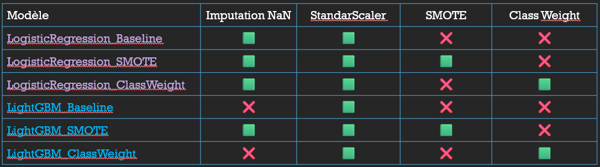

**4. Modélisation et évaluation des modèles**
- Algorithmes testés :  
  - **Régression logistique** (linéaire)  
  - **LightGBM / Gradient Boosting** (non linéaire)  
- **Validation croisée** pour comparer les performances sur plusieurs folds.  
- Objectif : choisir le modèle offrant le meilleur compromis **Recall / F1-score** sur la classe minoritaire.

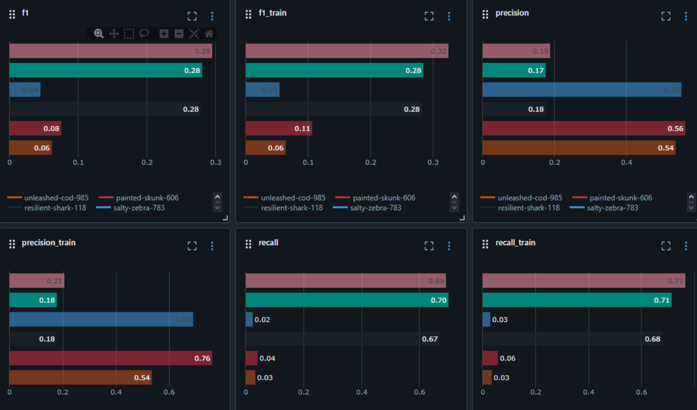

**5. Optimisation du seuil de prédiction**
- Analyse des métriques **Recall, Precision, F1** pour différents seuils.  
- Introduction d’un **score métier** :  

Coût total = FP + 10 × FN  
Score métier = 1 - (Coût total / Nombre total de clients)  

- **Seuil optimal trouvé** : 0,47  

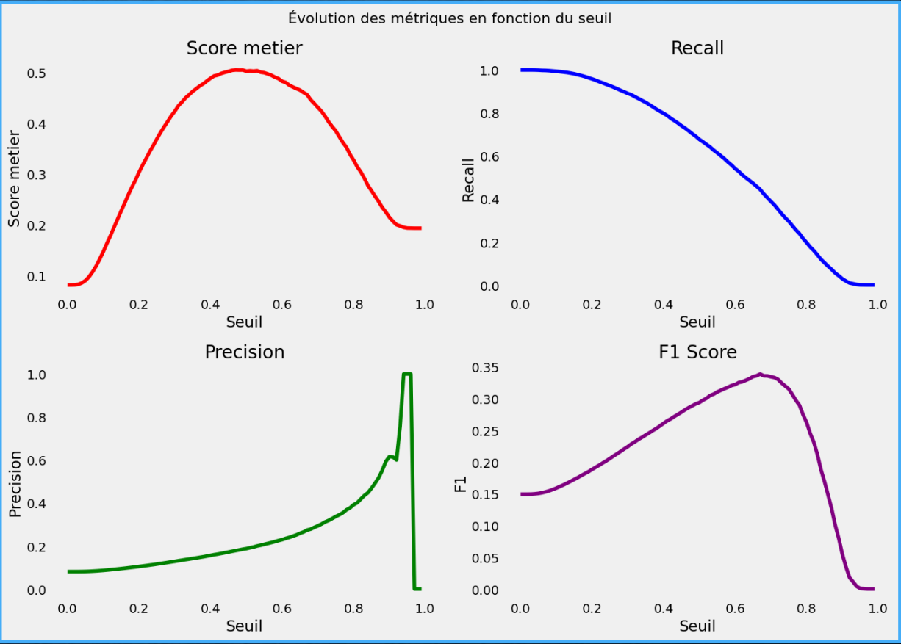

**6. Optimisation avec le score métier**
- Hyperparamètres optimisés via GridSearch en utilisant **make_scorer** basé sur le score métier  
- Permet d’aligner l’optimisation du modèle sur les coûts réels pour l’entreprise  

**7. Feature Importance Global et Local (SHAP)**
 **Importance globale**
- Mesure l’impact moyen de chaque variable sur le modèle  
- Identification des variables clés influençant la décision de crédit  
**Beeswarm plot (global)**

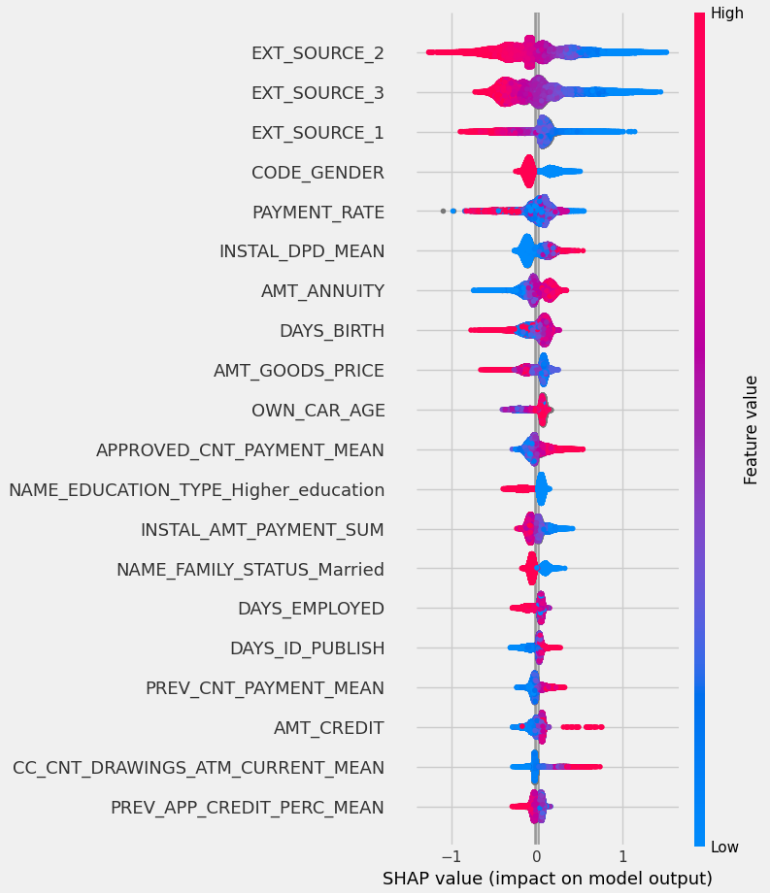

**Importance locale**
- Analyse individuelle des prédictions pour expliquer pourquoi un client est classé bon ou mauvais payeur  
**Waterfall plot (local)**,   

**8. API et mise en production CI/CD**
- Création de l’API via **FastAPI**  
- Versioning et suivi des scripts avec Git/GitHub  
- Tests unitaires automatisés  
- Déploiement sur **Azure App Service**  
- Dashboard Streamlit connecté à l’API pour visualisation et scoring client  

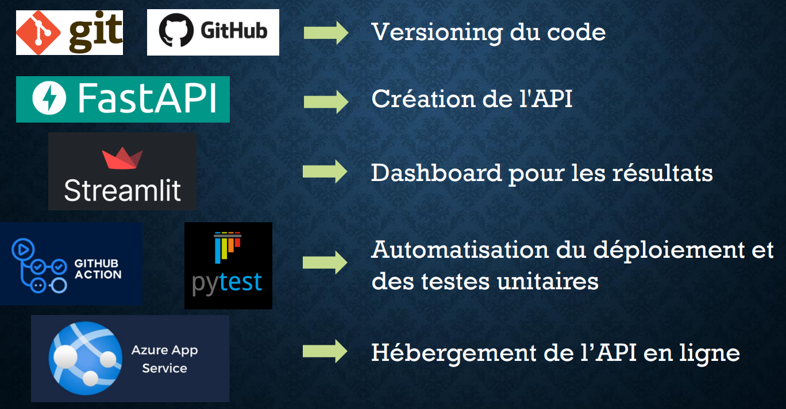

**9. Workflow CI/CD**
- Déclenchement automatique à chaque push sur `main`  
- Étapes : lint/format → build → tests unitaires → packaging → déploiement  
- Vérification qualité du code et stop si erreur  
- Artefacts générés et récupérés pour le déploiement  

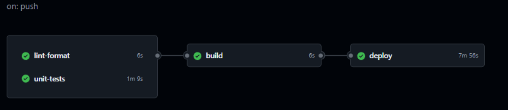

**10. Présentation du Dashboard**
**Onglet 1 – Info Client**
- Sélection du client via ID  
- Affichage des informations générales et prédiction du score  
- Modification des informations client et bouton « Reset »  
- Visualisation du risque via jauge Plotly et message coloré  

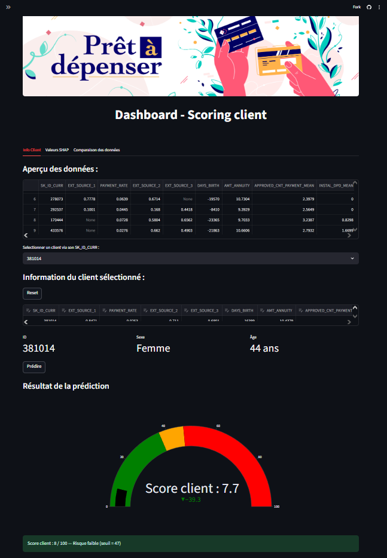

**Onglet 2 – Valeurs SHAP**
- **Local** : Waterfall plot pour chaque client  
- **Global** : Beeswarm plot pour l’ensemble du dataset  

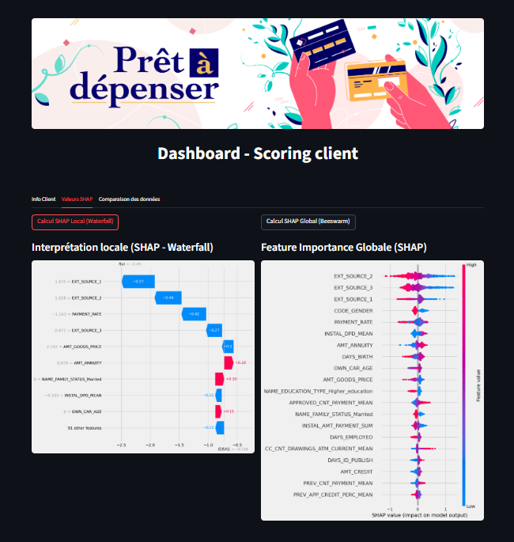

**Onglet 3 – Comparaison**
- Analyse univariée et bivariée  
- Comparaison du client à la population ou sous-groupes (sexe, tranche d’âge)  
- Nuages de points et histogrammes interactifs  

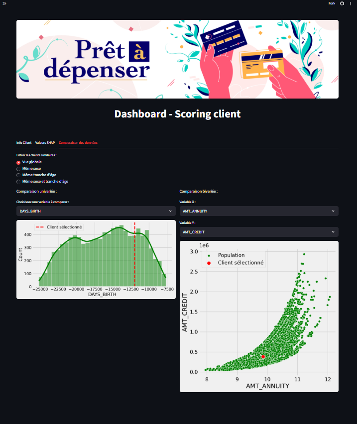

11. **Détection du Data Drift (Evidently)**
- **Objectif** : détecter les modifications de distribution des données en production  
- Méthodes : comparaison `app_train` vs `app_test`  
- Tests statistiques :  
  - Numériques : Wasserstein, Kolmogorov-Smirnov  
  - Catégorielles : Jensen-Shannon, Chi²  
- Résultats :  
  - Pas de drift global détecté (seuil 0,5)  
  - Drift détecté sur **9 variables (~7,4% des colonnes)**  

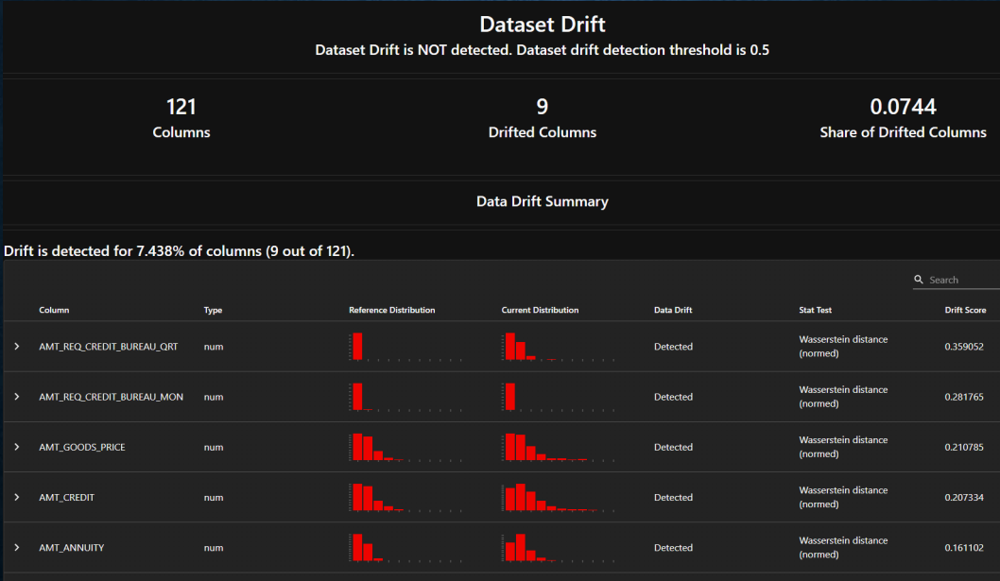

## Technologies et outils
- **Python** : pandas, numpy, scikit-learn, LightGBM, XGBoost  
- **MLOps** : MLflow, GitHub Actions, Azure  
- **API & Dashboard** : FastAPI, Streamlit  
- **Monitoring** : Evidently AI  
- **Visualisation** : matplotlib, seaborn, plotly  

## Contenu du repository
Ce repository contient l’ensemble des éléments produits dans le cadre du projet de scoring de crédit :  

## Dashboard Streamlit
Le dashboard interactif permet de visualiser le score de chaque client, les features importantes (SHAP) et d’analyser la position du client par rapport à la population ou à des sous-groupes.  

🔗 **Accéder au dashboard en ligne** : [Dashboard Streamlit](https://projet7-credit-default-risk-dashbord.streamlit.app)

## Conclusion
### Résultats globaux
- Le modèle final (LightGBM) fournit un compromis robuste entre **précision** et **rappel**.  
- Le pipeline complet couvre toutes les étapes : **exploration → modélisation → optimisation → déploiement → monitoring**.  
- Les solutions MLOps intégrées garantissent la **traçabilité**, la **reproductibilité** et la **surveillance en production**.  

### Perspectives
- Tester des approches de **deep learning** (réseaux de neurones).  
- Intégrer une API sécurisée avec authentification.  
- Automatiser le **retraining périodique** en fonction de la dérive détectée.  
- Étendre à d’autres produits financiers (scoring assurance, risque de fraude).  

## Contenu du repository

Ce repository contient tous les éléments nécessaires au projet de scoring de crédit :

- **`api/`** : scripts et fichiers liés à l'API FastAPI pour le scoring en temps réel.  
  - Contient des fichiers exemples clients (`sample_clients`) pour tester l'API.  

- **`data/`** : jeux de données utilisés pour l'analyse et la modélisation.  
  - Inclut également des fichiers exemples clients (`sample_clients`).  

- **`notebooks/`** : notebooks Jupyter pour l'exploration, le feature engineering et la modélisation.  
  - Contient des exemples de traitement de `sample_clients`.  

- **`assets/`** : ressources graphiques et médias pour le dashboard ou le README.  

- **`presentation.pdf`** : support de présentation synthétisant les résultats et recommandations.  

- **`README.md`** : documentation complète du projet.  

- **`requirements.txt`** : liste des dépendances Python nécessaires pour exécuter le projet.  

- **`.gitignore`** : fichiers et dossiers ignorés par Git.  

Chaque dossier et fichier est organisé pour faciliter l'accès et la reproduction du workflow de scoring, depuis l'analyse des données jusqu'à la mise en production et le monitoring.

## Livrables
- **Notebook Jupyter** : nettoyage, modélisation, visualisations.  
- **API FastAPI** : scoring en temps réel.  
- **Dashboard Streamlit** : interprétation et visualisation.  
- **Présentation** : synthèse des résultats et recommandations.  
